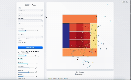
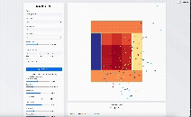
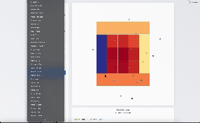

# Mapping Heat

Mapping Heat is an interactive web application for analyzing baseball pitch outcomes and visualizing predicted hit probabilities across the strike zone. The application combines a LightGBM classification model with an interactive D3.js strike zone visualization, historical matchup replays, and situational pitch sequence modeling.







## Features

- Interactive 14-zone strike zone heatmap displaying calibrated hit probabilities
- Pitch sequencing timeline to simulate pitch deltas in velocity and location
- Historical matchup at-bat replay engine stepping through past plate appearances
- Batter and pitcher metrics dashboard with discipline, contact, and repertoire splits
- Dynamic count adjustments across hitter-ahead and pitcher-ahead counts
- Handedness and switch-hitter support
- Historical pitch overlays from Statcast data

## Model and Data

The backend runs a LightGBM classifier trained on MLB Statcast data from the 2023 through 2025 seasons. The target variable is binary hit probability, where singles, doubles, triples, and home runs are classified as hits.

The feature set includes:
- Pitch kinematics: release speed, spin rate, horizontal movement (`pfx_x`), vertical movement (`pfx_z`), extension, spin axis, and release coordinates
- Location and speed interactions: horizontal location by speed, height by speed, and effective speed differentials
- Game situation: balls, strikes, count leverage, outs, inning, and base runners
- Sequencing: pitch number within plate appearance, preceding pitch type, speed delta, and spatial distance from the prior pitch location
- Player profiles: batter metrics (`wOBA`, `SLG`, `ISO`, `HardHit%`, `Barrel%`, `Contact%`, `O-Swing%`, `BB%`, `K%`) and pitcher metrics (`FIP`, `ERA`, `WHIP`, `K/9`, `BB/9`, `HR/9`, `SwStr%`, fastball velocity)
- Matchup platoon advantage

The model preserves unweighted probability calibration to match the baseline major league hit rate of roughly 24.8%.

## Quick Start

### Local Setup

1. Install Python dependencies:
   ```bash
   cd backend
   pip install -r requirements.txt
   ```

2. Generate data artifacts and train the model (if running for the first time):
   ```bash
   python pipeline.py
   ```

3. Start the Flask backend server:
   ```bash
   python app.py
   ```
   The API will listen on `http://localhost:5001`.

4. Start the frontend:
   ```bash
   cd ../frontend
   python -m http.server 8000
   ```
   Open `http://localhost:8000` in your web browser.

### Docker Setup

```bash
docker-compose up --build
```
The frontend is available at `http://localhost:80` and the backend at `http://localhost:5000` inside Docker.

## Project Structure

```
MapppingHeat/
├── backend/
│   ├── app.py           # Flask REST API server
│   ├── pipeline.py      # Statcast data fetcher, feature pipeline, and model trainer
│   ├── model.py         # Model loader and inference engine
│   ├── db.py            # SQLite database initialization and queries
│   ├── stats.py         # Matchup at-bat queries and statistics blueprint
│   ├── schema.sql       # Database table definitions
│   ├── requirements.txt # Python dependencies
│   ├── Dockerfile       # Backend container definition
│   └── artifacts/       # Model weights, player profiles, and rosters
├── frontend/
│   ├── index.html       # Single-page interface with D3.js visualization
│   ├── nginx.conf       # Nginx server configuration for container deployments
│   └── Dockerfile       # Frontend container definition
├── gifs/                # Interface preview animations
├── Makefile             # Development automation targets
└── docker-compose.yml   # Multi-service container specification
```

## API Endpoints

| Endpoint | Method | Description |
|---|---|---|
| `/rosters` | GET | List available batters and pitchers with stance and ID mappings |
| `/predict` | POST | Calculate hit probability given pitch parameters, context, and players |
| `/pitch-profile` | GET | Retrieve a pitcher's baseline velocity, movement, and release metrics |
| `/player-stats` | GET | Retrieve season statistics and pitch repertoire percentages |
| `/stats/pitcher` | GET | Retrieve historical Statcast pitches for a pitcher |
| `/stats/matchup-at-bats` | GET | List historical at-bats for a pitcher-batter matchup |
| `/stats/at-bat-pitches` | GET | Fetch pitch sequence data for an at-bat |

### Example API Calls

Get pitcher profile metrics:
```bash
curl "http://127.0.0.1:5001/pitch-profile?pitcher=Gerrit%20Cole&pitch_type=FF"
```

Get player stats and repertoire mix:
```bash
curl "http://127.0.0.1:5001/player-stats?player=Gerrit%20Cole&type=pitcher"
```

Fetch matchup at-bats by player IDs:
```bash
curl "http://127.0.0.1:5001/stats/matchup-at-bats?pitcher_id=543037&batter_id=646240"
```
